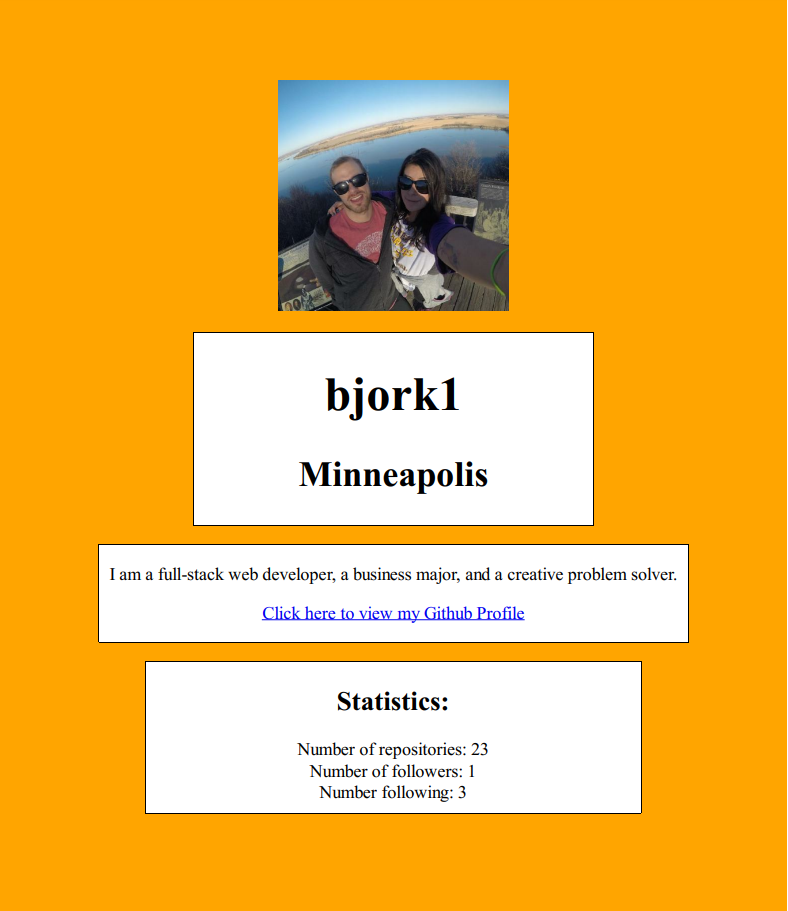

The Profile Generator is able to take information based off of inputs to generate a PDF profile made up of Github information.

The project is run in node.js by typing "node index.js" into the terminal.

The following two inputs are used to generate the profile:
Github Username
Favorite Color

The background image will represent the color the user inputs. The rest of the information included in the profile is as follows:
- Github username
- Github profile picture
- Location
- Bio
- Link to Github profile page
- Statistics, which include Number of repositories, Number of followers, and Number following

Here is an example of an outputed PDF:

